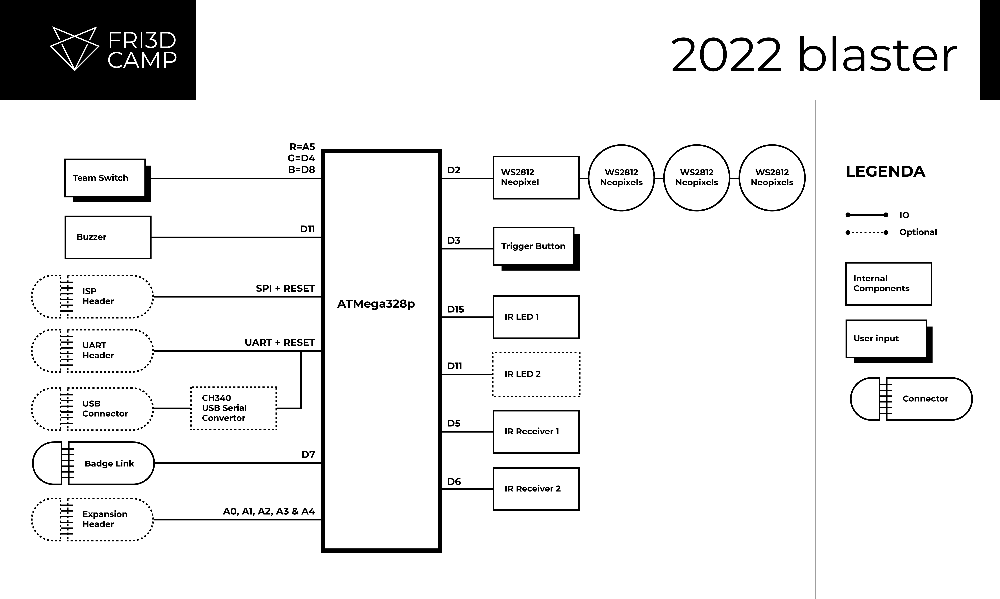
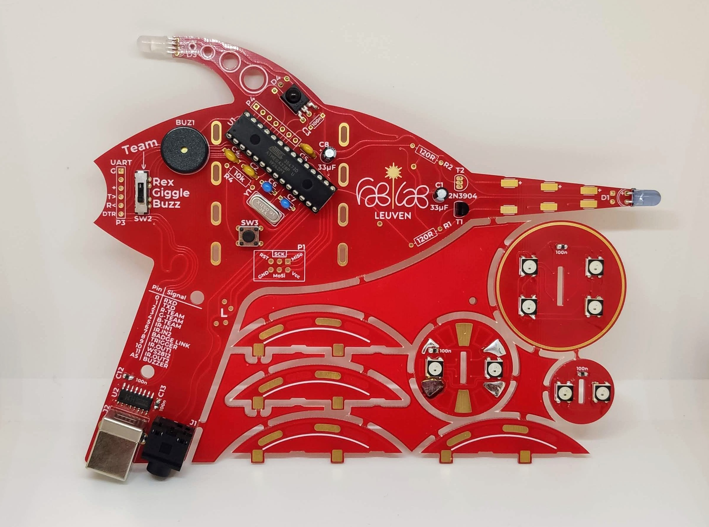
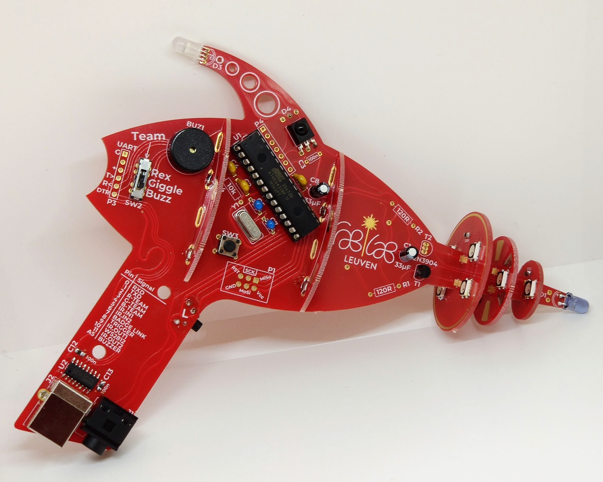
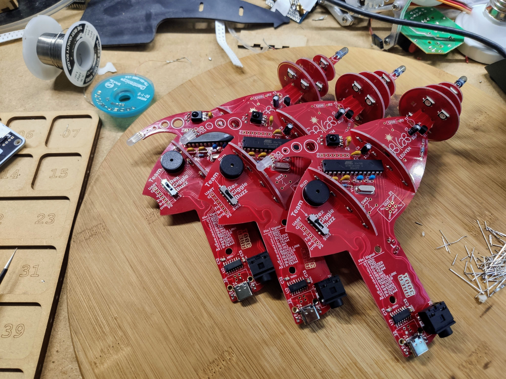
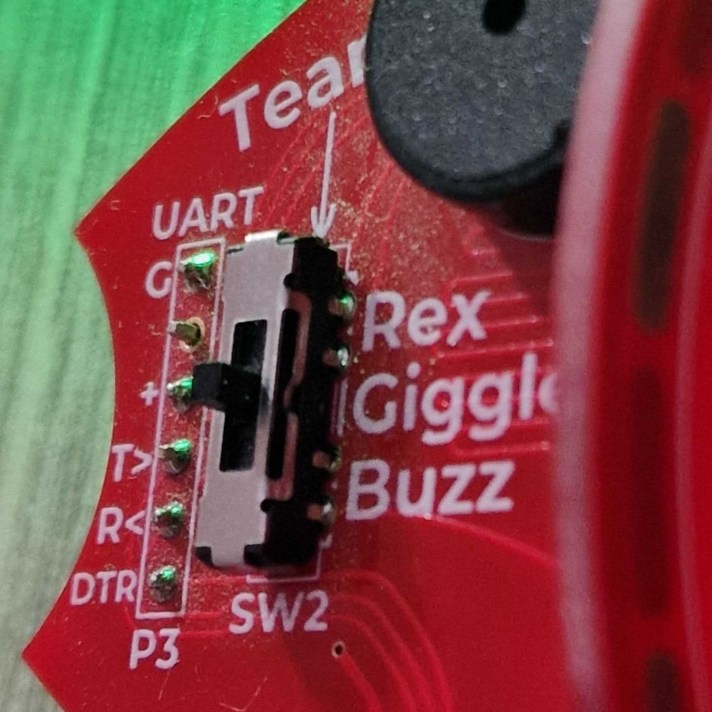
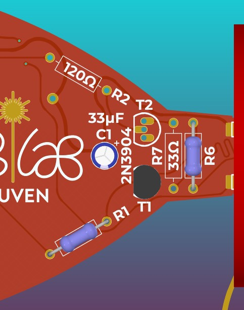
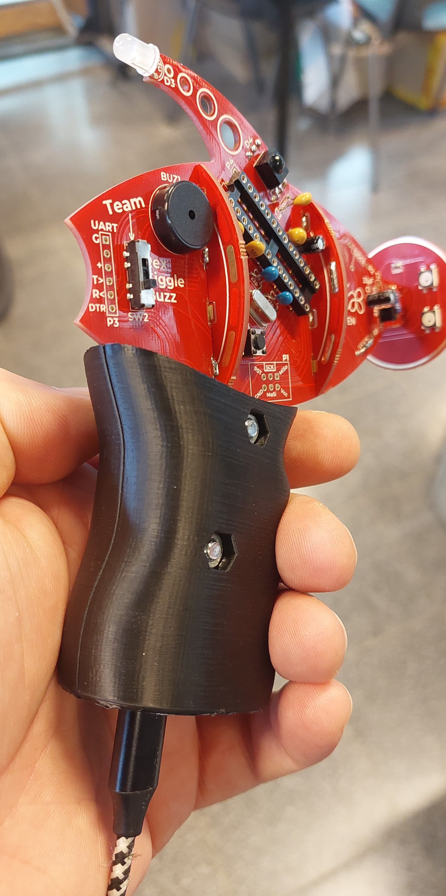

# Time Blaster

This repository contains the design files for the Time Blaster project part of Fri3d Camp 2020.

The design is based around an ATMega328p, some IR receivers and an IR LED.

The progress of this project can be followed on [Hackaday.io](https://hackaday.io/project/167668-time-blaster)

## Blockdiagram

In order to make the documentation easier to use, we've added the block diagram as well.

## Hardware Revision 00

## Hardware Revision 01

Added support for USB C and Micro USB. Fixed a bug with the USB Serial convertor, some pin swaps for firmware development.

## Hardware Revision 02

Added a series resistor for the IR LEDs, this is only required when powering the device from 5V.

# Assembly Instructions

## Resistor note
The 120Ω resistor has been marked with a red permanent marker since the color coding for the 120Ω and 10KΩ resistor are too similar

## Trigger switch
The side of the trigger switch can be chosen depending on left hand or right hand use case

## Team selection switch
Take note of silkscreen on the PCB for correct placement of the team selector switch. The switch has metal on 1 side, this side is also indicated on the PCB and should face the team names.

 
## Microcontroller soldering note
Take care when mounting the ATMega328p microcontroller, don't heat up the pins too long to avoid damaging them. To avoid creating a hot spot, you can opt for alternating sides when soldering the pins.

## Ring mounting
Mount the rings with SMD LEDs before you solder the IR LED in place.

## LED Polarity
The IR LED has a small + polarity marking on the board, this is the hole for the long lead of the LED.

## Which components to mount
R1 120Ω, MOSFET T1, R6 33Ω and IR LED D1 should be mounted 

 
Capacitor C4 (100nF), push button SW3 and right angle connector P3 are optional for Arduino style programming over FTDI UART connection.

## USB
Optional USB circuitry kits based around the CH340 USB to serial convertor are available upon request. These kits include an USB connector (USB-B, USB-C or Micro USB), 2 capacitors and the CH340 chip. In case of the USB-C variant, there will also be 2 resistors of 5.1kΩ included.

# 3D Printable grip
Thomas Pilkington designed a 3D printable grip for the blaster which vastly improves the ergonomics of the blaster, especially for adults. These files can either be printed as-is or modified to your preference. The model contains cutouts for both left- and righthanded triggers and for the optional USB-B or USB-C connector. The guys from [KO-LAB](https://ko-lab.space/) slightly modified the design for better clearance, these v2 files can also be found in the grip directory.

